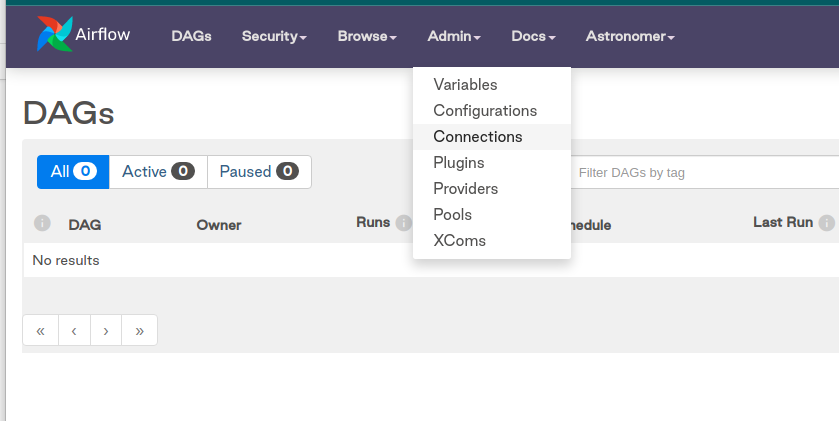
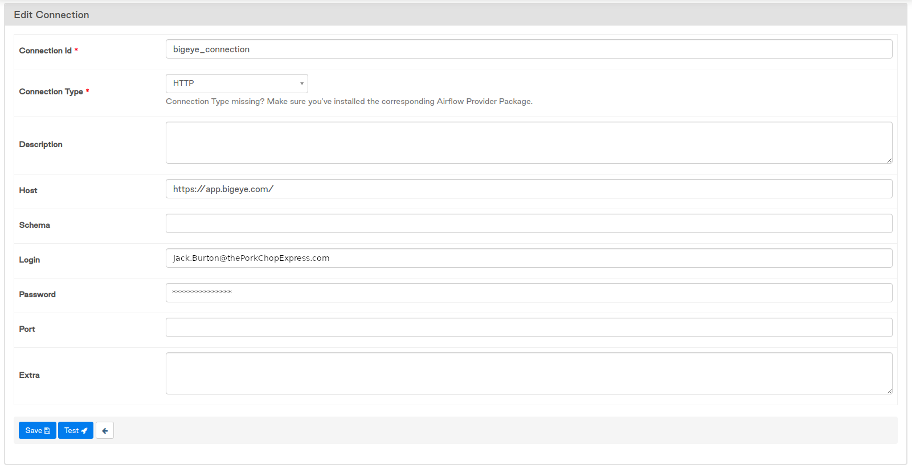

# bigeye-airflow
Airflow operators to interact with Bigeye API.

## The Test Environment
[Astronomer](astronomer.io) provides a local runtime for Airflow DAGs.  This runtime
is build from the Dockerfile in the astro folder.  A startup bash script has been 
added, ***astro_dev***, to facilitate the needed code copy into the astro environment.

Test environment is currently compatible with Python 3.6 and Airflow 1.10.7.

```shell
bash astro_dev start
bash astro_dev stop
bash astro_dev restart
```  
### Credentials Setup
* Go to the Admin menu and choose Connections:
      

* Fill out the form for an HTTP connection using the appropriate Host, User and Pass. The current test Dags use 
'bigeye_connection' as a connection_id for basic auth to the Bigeye API.
     

### Testing Metric Creation:  
Testing in a DAG runtime can be achieved by altering the test dag: 
[test_create_metrics_from_config_dag.py](https://github.com/bigeyedata/bigeye-airflow/blob/main/astro/dags/test_create_metrics_from_config_dag.py)

